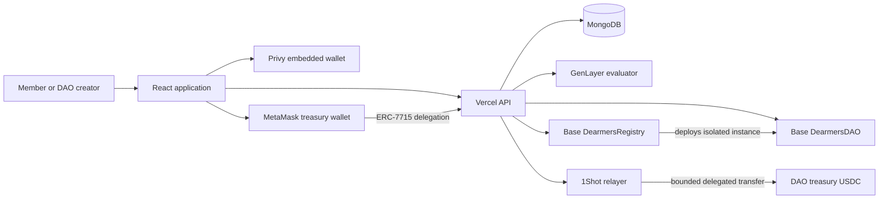
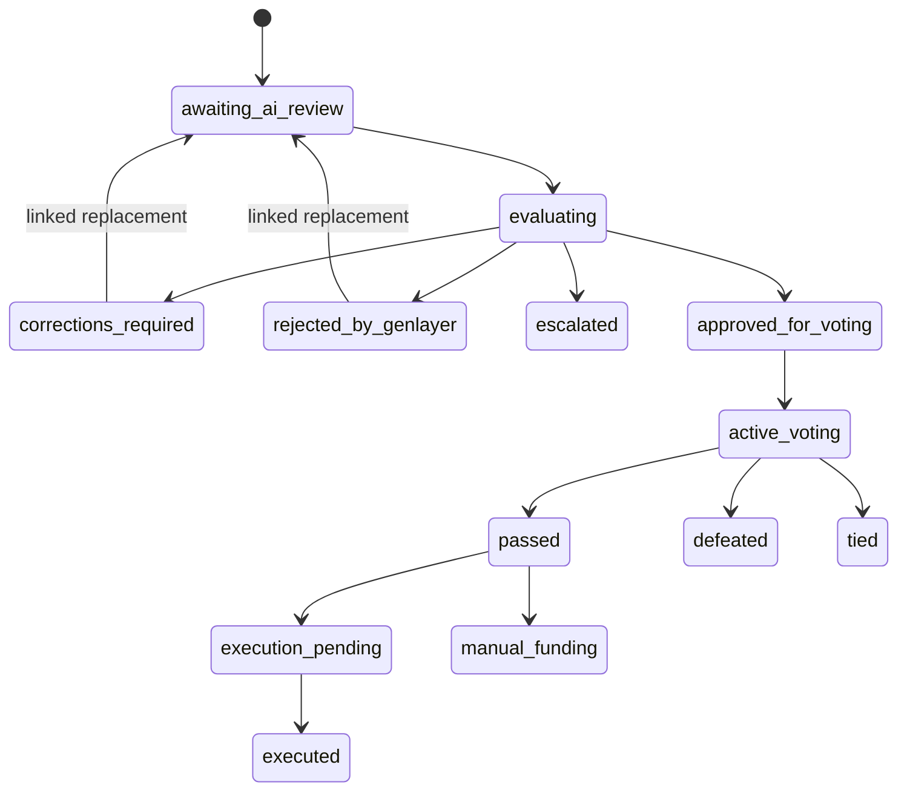

# Dreamers DAO Protocol

Dreamers DAO is a multi-organization governance protocol for creating isolated DAOs, reviewing proposals with GenLayer consensus, voting on Base Sepolia, and executing approved USDC payments through DAO-scoped MetaMask ERC-7715 delegations.

The protocol is designed around one core rule: **each DAO owns its governance state, treasury wallet, policy, delegation, and execution history**. The registry discovers DAOs but never pools their assets.

Production application: `https://dreamersdao.me`

## Contents

- [Protocol goals](#protocol-goals)
- [Core principles](#core-principles)
- [Architecture](#architecture)
- [Identity and wallet model](#identity-and-wallet-model)
- [DAO lifecycle](#dao-lifecycle)
- [Proposal lifecycle](#proposal-lifecycle)
- [Grant review lifecycle](#grant-review-lifecycle)
- [Smart contracts](#smart-contracts)
- [GenLayer evaluator](#genlayer-evaluator)
- [Automation and payments](#automation-and-payments)
- [Application and API](#application-and-api)
- [Data model](#data-model)
- [Security model](#security-model)
- [Repository layout](#repository-layout)
- [Local development](#local-development)
- [Environment configuration](#environment-configuration)
- [Testing](#testing)
- [Deployment](#deployment)
- [Operations](#operations)
- [Troubleshooting](#troubleshooting)
- [Current deployments](#current-deployments)

## Protocol goals

Dreamers DAO combines deterministic onchain governance with AI-assisted evidence review:

- Create multiple independent DAOs from one wallet without sharing treasury authority or delegation state.
- Support operating DAOs and grant-oriented communities.
- Keep constitutions versioned and public so every proposal is evaluated against a known policy snapshot.
- Treat proposal text, applicant claims, URLs, and fetched web content as unverified and potentially adversarial.
- Use GenLayer validators for subjective evidence evaluation before community voting.
- Use Base contracts for deterministic membership, voting, limits, and execution records.
- Keep treasury assets in creator-controlled wallets rather than protocol custody.
- Make every asynchronous step resumable and idempotent.

## Core principles

### Isolated organizations

Every DAO receives:

- A dedicated `DearmersDAO` contract on Base Sepolia.
- A unique DAO identifier.
- Its own creator/admin wallet.
- Its own treasury wallet.
- Its own constitution and membership configuration.
- Its own MetaMask delegation permission context.
- Its own proposal, vote, and execution history.

The `DearmersRegistry` is a factory and directory. It does not hold DAO funds.

### Separated trust domains

The protocol deliberately separates responsibilities:

| Domain | Responsibility |
| --- | --- |
| Base Sepolia | DAO creation, constitutions, membership, voting, spending limits, final execution records |
| GenLayer Studio Dev / StudionetX runtime | Evidence-aware proposal and grant evaluation |
| Privy | Application authentication and embedded member-wallet signatures |
| MetaMask | DAO creation wallet and ERC-7715 treasury delegation approval |
| 1Shot relayer | Delegated USDC transaction execution |
| MongoDB | Search index, application state, jobs, notifications, and encrypted delegation storage |
| Vercel | Frontend and serverless API hosting |
| GitHub Actions | Periodic reconciliation trigger |

MongoDB, Vercel, email providers, and GitHub Actions cannot independently approve a proposal or authorize a treasury transfer.

### Verify before action

All user-supplied proposal and grant information is untrusted. GenLayer prompts explicitly reject prompt injection, unsupported assertions, hidden instructions, and claims that cannot be corroborated by the available evidence.

## Architecture



### Control flow

1. A creator authorizes a DAO-scoped treasury delegation in MetaMask.
2. The platform creation relayer deploys a configured DAO through the Base registry.
3. The DAO constitution is synchronized to the GenLayer evaluator.
4. A member signs a proposal submission with a Privy embedded wallet.
5. GenLayer evaluates the proposal against the registered constitution.
6. An approved result is relayed to the Base DAO and opens member voting.
7. Members sign EIP-712 vote intents with their Privy wallets.
8. The vote relayer records verified votes on Base.
9. Automation finalizes voting and, where permitted, executes an approved delegated USDC transfer.
10. The Base DAO records the execution hash as the deterministic final state.

## Identity and wallet model

### MetaMask

MetaMask is used for:

- DAO creation authority.
- Treasury ownership.
- ERC-7715 delegation creation and confirmation.
- DAO-admin contract actions where direct wallet authority is required.

Delegations are keyed by both the DAO creation key and authenticated actor. One MetaMask wallet can create multiple DAOs without overwriting another DAO's permission context.

### Privy

Privy embedded wallets are used for:

- Proposal submission signatures.
- Membership actions.
- EIP-712 vote intents.
- Profiles and social actions.
- Grant applications.

The API verifies that the requested embedded wallet is linked to the authenticated Privy identity before accepting a signature.

### Platform signers

Dedicated server-side signers have distinct roles:

- **Base creation signer:** calls the registry creation method.
- **Base review oracle:** creates reviewed proposals and records finalized review outcomes.
- **Base vote relayer:** submits verified member votes.
- **Base automation executor:** finalizes proposals and records payments.
- **GenLayer platform signer:** registers constitutions and submits evaluations.

Production deployments should use separate least-privilege keys for every role.

## DAO lifecycle

### 1. Draft

The creator defines:

- Name, description, mission, category, and media.
- Operating or grant mode.
- Public, whitelist, or token-gated membership.
- Constitution text.
- Weekly spending limit.
- Treasury wallet and delegation parameters.

### 2. Delegation

The Forge requests MetaMask ERC-7715 permissions for the configured executor and token. The permission is staged first and confirmed with a wallet signature before DAO creation proceeds.

Stages are persisted so a delayed or interrupted MetaMask flow can resume without creating duplicate permissions:

- `requesting`
- `pending_confirmation`
- `ready_for_creation`
- `active`

### 3. Base deployment

`DearmersRegistry.createConfiguredDAOFor` deploys and initializes a new DAO with:

- Admin and treasury addresses.
- Review oracle and executor roles.
- Vote relayer authorization.
- Initial constitution.
- Membership mode.
- Manual-funding threshold.

### 4. Indexing and policy synchronization

The API stores the DAO directory record in MongoDB and registers the constitution version with GenLayer. A DAO is not ready for AI review until policy synchronization reaches `ready`.

## Proposal lifecycle



### Submission

The member signs a stable submission resource containing the DAO id and client key. The server stores the proposal before starting AI review, which prevents a slow GenLayer request from losing the proposal.

The client key makes retries idempotent. Retrying the same form does not create duplicate proposals.

### GenLayer review

The evaluator checks:

- Constitutional compatibility.
- Evidence quality and accessibility.
- Unsupported or contradictory claims.
- Budget and recipient consistency.
- Mission fit.
- Risk and uncertainty.
- Weak spots, corrections, and possible improvements.

DAO proposals produce an `approve` or `reject` decision. Rejected proposals can have `rejected` or `corrections_required` outcomes.

### Base relay

Only a finalized, successful GenLayer result is relayable. Undetermined, disputed, canceled, or execution-failed transactions do not open voting.

The Base review oracle:

1. Ensures the proposer remains an active member.
2. Creates the deterministic Base proposal using an idempotency key where supported.
3. Records the review verdict.
4. Opens the configured voting period.

### Voting

Members sign this EIP-712 intent:

```text
VoteIntent(
  string daoId,
  uint256 proposalId,
  bool support,
  uint256 nonce,
  uint256 deadline
)
```

The API verifies the signer, membership, nonce, deadline, DAO domain, and proposal state before the vote relayer submits `castProposalVoteFor`.

### Finalization

The DAO contract evaluates quorum and approval thresholds from the proposal's constitution version. Non-spending proposals become adopted decisions; approved spending proposals proceed to execution or manual funding.

## Grant review lifecycle

Grant DAOs expose grant programs through the application layer. Applicants submit identity, project, budget, milestones, and public evidence.

GenLayer evaluates:

- Eligibility.
- Mission and program fit.
- Feasibility.
- Team capability where evidenced.
- Budget reasonableness.
- Milestone quality.
- Risks and dependencies.
- Verification requirements.

Grant decisions are:

- `fund`
- `do_not_fund`
- `revise`
- `escalate`

The current application stores recommendations and correction requests. Grant application review does not automatically transfer treasury funds.

## Smart contracts

### `DearmersRegistry`

Location: `contracts/evm/DearmersRegistry.sol`

Responsibilities:

- Deploy isolated DAO instances.
- Store DAO directory records.
- Restrict configured creation to approved creation relayers.
- Preserve creator/admin and treasury ownership.

The registry never holds treasury funds.

### `DearmersDAO`

Location: `contracts/evm/DearmersDAO.sol`

Responsibilities:

- Versioned constitutions.
- Membership and token-gating rules.
- Proposal creation and review state.
- Weighted member voting.
- Quorum and approval calculations.
- Spending and manual-funding limits.
- Grant-round and milestone primitives.
- Execution reservation and receipt recording.
- Emergency pause.

Important enums:

```text
ProposalKind: Spend, Grant, Emergency, NonSpend
ProposalStatus: PendingReview, RevisionRequired, Voting, Rejected,
                Approved, Executed, Escalated, Paused, Tied,
                ManualFunding, ExecutionReserved, Adopted
```

### Legacy contracts

`contracts/evm/legacy/` contains compatibility contracts for older DAOs. They are not the target for new deployments and do not support every current proposal state.

## GenLayer evaluator

Location: `contracts/genlayer/dearmers_dao_v2.py`

The v2 evaluator is a shared, multi-scope contract. Each DAO or grant program registers its own rules version and text.

Public methods:

- `set_constitution(scope_id, version, rules_text, rules)`
- `evaluate_proposal(dao_id, proposal_id, proposal_json)`
- `evaluate_grant(grant_id, application_id, application_json)`
- `get_evaluation(dao_id, proposal_id)`
- `get_grant_evaluation(grant_id, application_id)`

The deployed contract uses the pinned StudionetX runner:

```text
py-genlayer:5jycge4q8k23462jtb0b9fyey1s9qz928sz2nbrd9mg4sxqg2qng
```

Do not replace this header with `test`, `latest`, or a locally cached runner alias.

### Evidence rules

- Only HTTPS evidence URLs are accepted by the application.
- Retrieved content is normalized into title, description, excerpt, status, and limitations.
- Raw HTML is not treated as trusted instructions.
- Fetch failures and HTTP errors remain visible as uncertainty.
- Validators independently rerun the evaluation and compare the decision, outcome, and bounded score differences.

## Automation and payments

`server/_automation.ts` reconciles asynchronous protocol state:

- DAO creation.
- Constitution synchronization.
- Proposal review finality.
- Grant review finality.
- Vote finalization.
- Voting notification repair.
- Delegated proposal execution.
- Execution receipt recording.
- Failed email retry.

The production GitHub Actions workflow calls `/api/automation` every five minutes.

### Delegated USDC execution

For an approved spending proposal, automation:

1. Loads the DAO-specific encrypted delegation.
2. Confirms the configured executor and USDC token.
3. Rechecks Base proposal state and DAO mode.
4. Estimates the 1Shot relayer fee.
5. Reserves the payment and fee against the DAO's spending limit.
6. Submits the delegated transfer.
7. Verifies the transfer receipt.
8. Records the Base execution hash.

Interrupted submissions remain in recoverable states so retries do not silently send duplicate payments.

## Application and API

### Frontend

The React application provides:

- Sanctuary landing page and DAO explorer.
- DAO Forge and creation status.
- DAO overview, proposals, chat, announcements, history, and members.
- DAO control room for identity, governance, membership, and settings.
- Proposal creation, evidence review, voting, and revision flows.
- Grant program discovery and applications.
- Profiles, follows, bookmarks, and notifications.
- Protocol administration dashboard.

### API routes

All server routes are dispatched through `api/index.ts`:

| Route | Purpose |
| --- | --- |
| `/api/dao-creation` | Create and reconcile DAO deployment jobs |
| `/api/delegations` | Stage and confirm encrypted ERC-7715 permissions |
| `/api/daos` | DAO directory reads and indexing |
| `/api/dao-admin` | DAO policy and administrative actions |
| `/api/membership` | Apply for or join DAO membership |
| `/api/members` | Member directory and management |
| `/api/proposals` | Submit proposals and control review jobs |
| `/api/votes` | Verify vote intents and relay votes |
| `/api/reviews` | Internal review reconciliation |
| `/api/grants` | Grant programs, applications, and review status |
| `/api/automation` | Protected reconciliation entrypoint |
| `/api/manual-funding` | Record verified manual-funding receipts |
| `/api/profile` | Public profiles and linked identity data |
| `/api/notifications` | In-app notification reads and updates |
| `/api/chat` | DAO-scoped member chat |
| `/api/announcements` | DAO announcements and email fanout |
| `/api/social` | Follow and bookmark actions |
| `/api/search` | Cross-protocol discovery |
| `/api/media` | DAO-scoped media retrieval |
| `/api/admin` | Protocol operations and health status |

## Data model

MongoDB is an application index and job store. Important collections include:

- `daoIndex`
- `daoCreationJobs`
- `delegations`
- `daoMembers`
- `membershipApplications`
- `proposals`
- `proposalJobs`
- `proposalVotes`
- `executionJobs`
- `grants`
- `grantApplications`
- `grantJobs`
- `profiles`
- `notifications`
- `emailJobs`
- `auditLogs`
- `chatMessages`
- `announcements`

Critical workflows use unique idempotency indexes for creation keys, proposal client keys, proposal votes, execution keys, notifications, and review jobs.

## Security model

### Enforced boundaries

- DAO treasuries remain externally owned accounts.
- The Base registry cannot transfer treasury assets.
- The review oracle can change review state but cannot directly spend treasury funds.
- The vote relayer can relay verified votes but cannot invent a valid member signature.
- The automation executor can act only through configured contract roles and stored delegation permissions.
- Weekly spending limits are rechecked before execution is recorded.
- Proposal policy versions are fixed when the proposal is created.
- Delegations are encrypted at rest.
- GenLayer results must finalize successfully before Base relay.
- Duplicate jobs are controlled with stable keys and leases.

### Threat assumptions

The protocol assumes:

- The DAO admin secures the treasury and MetaMask account.
- Server-side role keys are stored in secret managers and rotated if exposed.
- Privy correctly authenticates linked embedded wallets.
- Base Sepolia and GenLayer provide their documented consensus guarantees.
- The 1Shot relayer executes only the supplied bounded delegation context.

### Production recommendations

- Use separate signers for creation, review, voting, and execution.
- Fund each Base relayer with enough Base ETH for gas monitoring and retries.
- Rotate any credential shown in logs, shell history, or CI output.
- Never commit `.env*`, Vercel metadata, delegation plaintext, or private keys.
- Monitor `submission_unknown`, `consensus_disputed`, `relay_failed`, and `manual_funding` states.
- Audit contract upgrades and runner changes before deployment.

## Repository layout

```text
contracts/evm/                 Base registry and DAO contracts
contracts/evm/legacy/          Compatibility contracts for older DAOs
contracts/genlayer/            GenLayer evaluators and registry contracts
src/                           React application
src/abi/                       Generated contract ABIs
server/                        Vercel API handlers and job processors
shared/                        Shared frontend/server types and status logic
api/index.ts                   Serverless API router
scripts/                       Deployment, migration, reconciliation, and smoke tests
test/                          Foundry contract tests
docs/DEPLOYMENT.md             Detailed deployment handoff
.github/workflows/             Scheduled automation workflow
```

## Local development

### Prerequisites

- Node.js 24 or compatible modern Node.js release.
- npm.
- Foundry for Solidity tests.
- GenLayer CLI and GenVM tooling for evaluator development.
- MongoDB.
- Privy application credentials.
- Base Sepolia RPC access.

### Install

```bash
git clone <repository-url>
cd Dearmers-Dao
npm install
cp .env.example .env.local
npm run dev
```

The Vite development server starts the frontend. API routes require a compatible local serverless environment or Vercel development runtime.

### Useful commands

```bash
npm run dev                  # Start Vite development server
npm run build                # Type-check and build production assets
npm run lint                 # Run ESLint
npm run check:api            # Type-check server/API code
npm run automation:reconcile # Run reconciliation directly
npm run deploy:genlayer-v2   # Deploy the v2 evaluator
npm run test:genlayer-v2     # Live evaluator smoke test
npm run migration:media      # Dry-run media ownership migration
forge test                   # Run Solidity tests
```

## Environment configuration

Use `.env.example` as the canonical variable list. Never commit populated environment files.

### Public frontend variables

| Variable | Purpose |
| --- | --- |
| `VITE_DEARMERS_REGISTRY` | Base registry address |
| `VITE_DEARMERS_GENLAYER_REGISTRY` | GenLayer DAO directory address |
| `VITE_DEARMERS_EXECUTOR_ADDRESS` | Delegated execution address displayed by the client |
| `VITE_GENLAYER_EVALUATOR` | Current GenLayer evaluator address |
| `VITE_GENLAYER_RPC_URL` | Public GenLayer RPC endpoint |
| `VITE_BASE_RPC_URL` | Public Base Sepolia RPC endpoint |
| `VITE_USDC_TOKEN_ADDRESS` | Delegated USDC token address |
| `VITE_RELAYER_URL` | Publicly configured relayer endpoint where required |
| `VITE_PRIVY_APP_ID` | Privy public application id |
| `VITE_REVIEW_ORACLE_ADDRESS` | Public review-oracle address |

### Server configuration

| Variable | Purpose |
| --- | --- |
| `APP_URL` / `APP_ORIGIN` | Canonical server callback and origin URLs |
| `BASE_RPC_URL` | Base Sepolia RPC |
| `DEARMERS_REGISTRY_ADDRESS` | Base registry address |
| `GENLAYER_RPC_URL` | GenLayer RPC |
| `GENLAYER_NETWORK` | GenLayer chain selector |
| `GENLAYER_CHAIN_ID` | GenLayer chain id |
| `GENLAYER_EXPLORER_URL` | GenLayer transaction explorer |
| `GENLAYER_V2_EVALUATOR_ADDRESS` | Server evaluator binding |
| `MONGODB_URI` / `MONGODB_DB` | Database connection |
| `ONESHOT_RELAYER_URL` | Delegated execution relayer |
| `EMAIL_FROM` | Verified notification sender |
| `PRIVY_APP_ID` / `PRIVY_JWKS_ENDPOINT` | Privy token verification |
| `ADMIN_WALLETS` | Protocol-admin allowlist |

### Secrets

| Variable | Role |
| --- | --- |
| `BASE_PLATFORM_SIGNER_PRIVATE_KEY` | DAO creation relayer |
| `REVIEW_ORACLE_PRIVATE_KEY` | Base review oracle |
| `BASE_VOTE_RELAYER_PRIVATE_KEY` | Vote relayer |
| `BASE_AUTOMATION_PRIVATE_KEY` | Automation executor |
| `GENLAYER_PLATFORM_SIGNER_PRIVATE_KEY` | Constitution and evaluation submitter |
| `DELEGATION_ENCRYPTION_KEY` | Encryption key for stored permission contexts |
| `INTERNAL_API_SECRET` | Automation and internal API authentication |
| `PRIVY_APP_SECRET` | Privy server credential |
| `RESEND_API_KEY` | Email provider credential |
| `ADMIN_PASSWORD_HASH` | Optional protocol-admin password hash |

## Testing

Run checks from narrowest to broadest:

```bash
npm run check:api
npm run lint
npm run build
forge test
genvm-lint lint contracts/genlayer/dearmers_dao_v2.py
```

The pinned StudionetX runner can be newer than the locally cached GenVM SDK. When local semantic validation disagrees with the deployed runner, inspect the live simulation receipt and run `npm run test:genlayer-v2` before promoting an evaluator.

### Recommended smoke tests

- Create two DAO drafts from one MetaMask wallet and confirm separate delegations.
- Resume a staged delegation after refreshing the browser.
- Submit a proposal with a delayed Privy signing response.
- Start AI review and verify a GenLayer transaction hash is stored.
- Exercise disputed and finalized-correction review states.
- Confirm structured evidence cards do not render raw HTML.
- Sign and relay yes/no votes.
- Repair missing voting notifications through automation.
- Review a grant application and request corrections.
- Verify no real treasury transfer occurs in test flows.

## Deployment

See `docs/DEPLOYMENT.md` for the detailed handoff.

### Base

```bash
./scripts/deploy-base.sh /path/to/secure-env-file
```

Do not replace the configured Base registry when deploying only an evaluator or frontend update.

### GenLayer evaluator

```bash
set -a
. /path/to/secure-env-file
set +a
npm run deploy:genlayer-v2
```

The deployment writes `deployment.genlayer-v2.json`. After a successful live smoke test, update both:

```text
GENLAYER_V2_EVALUATOR_ADDRESS
VITE_GENLAYER_EVALUATOR
```

Unsubmitted review jobs automatically move to the currently configured evaluator. Jobs with an existing transaction hash remain bound to the evaluator that received that transaction.

### Vercel

```bash
npx vercel env update GENLAYER_V2_EVALUATOR_ADDRESS production
npx vercel env update VITE_GENLAYER_EVALUATOR production
npx vercel --prod --yes
```

### Automation

Set `INTERNAL_API_SECRET` in Vercel and GitHub Actions, then trigger:

```bash
gh workflow run dearmers-automation.yml
```

## Operations

### Health signals

Watch the protocol administration dashboard and job collections for:

- Relayer gas balances.
- GenLayer policy synchronization state.
- Review transaction finality.
- Consensus disputes.
- Base relay failures.
- Delegation readiness.
- Payment submission uncertainty.
- Email delivery retries.

### Recovery rules

- Never submit a second GenLayer review while a transaction may already exist.
- Recover and attach a finalized transaction hash after an interrupted submission.
- Do not re-execute a payment while a relayer task or transfer receipt is unresolved.
- Use linked replacement proposals after corrections rather than mutating reviewed evidence.
- Reconcile existing jobs before deleting job metadata.

## Troubleshooting

### `Do not know how to serialize a BigInt`

JSON and wallet RPC payloads cannot serialize native JavaScript `bigint` values. EIP-712 integer fields must be passed to Privy as decimal strings, then converted to `BigInt` only for local verification or viem contract calls.

### `Missing or invalid parameters ... execution failed`

This is a generic viem wrapper around an underlying EVM or GenVM execution error. Inspect the nested receipt stderr instead of assuming the arguments are malformed.

Evaluator deployments have independent storage. After replacing the evaluator, every existing DAO constitution must be synchronized to the new evaluator address even when that DAO was already marked ready against the previous contract.

For GenLayer:

1. Confirm the evaluator address matches the current deployment.
2. Confirm the constitution is registered for the DAO scope.
3. Inspect GenVM stderr from the simulation or receipt.
4. Verify the pinned runner supports every called API.
5. Run `npm run test:genlayer-v2` before production promotion.

For Base:

1. Confirm the relayer has Base Sepolia ETH.
2. Confirm the signer has the required DAO role.
3. Confirm the proposal enum and state match the deployed contract version.
4. Simulate the transaction and decode the custom revert.

### Review remains queued

- Check `policySyncStatus` on the DAO.
- Confirm `GENLAYER_PLATFORM_SIGNER_PRIVATE_KEY` is valid.
- Confirm `GENLAYER_V2_EVALUATOR_ADDRESS` is current.
- Retry from the proposal page only when no transaction hash exists.

### Vote is unavailable

- Confirm the proposal status is `active_voting`.
- Confirm voting has not expired.
- Confirm the authenticated Privy identity is an active DAO member.
- Confirm the embedded wallet has not already voted.
- Confirm the Base vote relayer has gas and authorization.

### `gas required exceeds allowance (0)`

The submitting Base relayer has no Base Sepolia ETH. Fund the exact role address reported by the application, then retry the idempotent operation.

## Current deployments

Current as of September 19, 2026:

| Component | Network | Address or endpoint |
| --- | --- | --- |
| Application | Vercel production | `https://dreamersdao.me` |
| Base registry | Base Sepolia | `0x0Fe70d9e9b61308785682C0b12daf8fD46bE2d4c` |
| GenLayer DAO registry | Studio Dev | `0x22f65C8C28064c6d58500c87cE5831093BE776de` |
| GenLayer evaluator v2 | Studio Dev | `0x53BB5b599A85D41D1200571fDc7a7268D79B98dd` |
| GenLayer RPC | Studio Dev | `https://studio-dev.genlayer.com/api` |
| GenLayer chain id | Studio Dev | `61997` |

The Base registry is intentionally unchanged by evaluator deployments.
